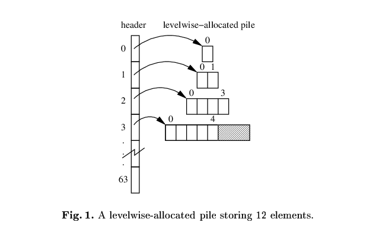

# Exponentially-segmented arrays

Via [Per Vognsen](https://hachyderm.io/@pervognsen@mastodon.social/114858718666416107):

> What's the standard CS name for the (stable, non-reallocating) dynamic array data structure based on power-of-two segment lengths where you do two-level indexing via x = ilog2(i), y = i - (1 << x) where i is a 1-based linear index? I've always called it an exponentially segmented array but never been able to find the earliest reference in the literature or what the canonical name for it is; it feels basic enough that it should be in Knuth.

They linked to this diagram:

Not sure I've ever used something like this but I can see how it would be useful. Per added:

> It's a dynamic array implementation with the same asymptotics as a normal reallocating dynamic array but without the pointer invalidation when it grows. So if you want to want to avoid invalidating pointers when the array grows, e.g. for an arena or when you have concurrent multi-threaded readers, it's an option. And unlike using fixed-size segments you only need a small number of segments in the worst case, so you can just have a static array of segment pointers in the header.
