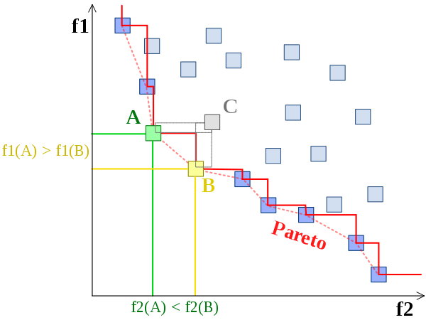

# Pareto frontier

I learned about the concept of a _Pareto frontier_ from the paper [Copy-and-Patch Compilation](https://sillycross.github.io/assets/copy-and-patch.pdf):

> We evaluate our algorithm by evaluating the copy-and-patch-based compilers we built for WebAssembly and our high-level language. [...] Our results show
that our algorithm replaces all prior baseline compilers on the Pareto frontier and moves first-tier compilation closer to the performance of optimizing compilers.

It's named after the Italian engineer and economist [Vilfredo Pareto](https://en.wikipedia.org/wiki/Vilfredo_Pareto) (who also gave us the _Pareto Principle_, aka the 80-20 rule). The concept applies to any problem where you're evaluating solutions based on multiple objectives. JIT compilers are a good example: you care about how long compilation takes, as well as how fast the resulting code is.

I find it easiest to understand visually. You've got a number of solutions, which you can plot based on their performance on the metrics you care about:

<figure>
  
  <figcaption>Example of a <i>Pareto frontier</i>. Points A and B are on the Pareto frontier, while C is not.</figcaption>
</figure>

Assuming you've chosen an initial solution, a _Pareto improvement_ would be a solution that is better on both axes. In the example above, moving from C to either A or B is a Pareto improvement. For JIT compilers, that would mean a compiler that's both faster, and which produces faster code.

The Pareto frontier is the set of solutions where there's no Pareto improvement — meaning, you can't improve on one axis without getting worse on the other axis.
