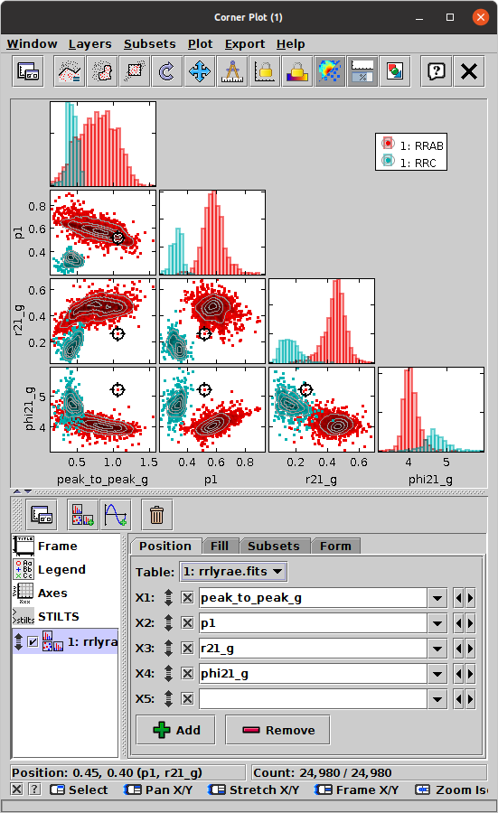

# Corner plot

For a project that I'm working on, I wanted to understand the shape of the cost function for a simple optimization problem. Since there were only two parameters, I used a heat map with the parameters on the x/y axes and the color showing the cost function at each point.

But I wondered what I would do with a higher-dimensional problem. And then I learned about [corner plots](https://www.star.bris.ac.uk/~mbt/topcat/sun253/MatrixPlotWindow.html):

> The Corner Plot represents the relationships between multiple quantities by drawing **a scatter-like plot of every pair of coordinates, and/or a histogram-like plot of every single coordinate, and placing these on (half or all of) a square grid.** The horizontal coordinates of all the plots on each column, and the vertical coordinates of all the plots on each row, are aligned. The plots are all linked, so you can make graphical selections or click on a point to activate it in one of the panels, and the other panels will immediately reflect that action. Single-coordinate (histogram-like) plots appear on the diagonal, and coordinate-pair (scatter plot-like) plots appear off diagonal. By default only the diagonal and sub-diagonal part of the resulting plot matrix is shown, since the plots above the diagonal are equivalent to those below it, but this is configurable. This representation is variously known as a corner plot, scatter plot matrix, or pairs plot.

