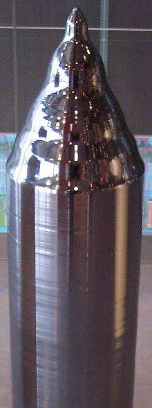

# Why silicon wafers are round

I was reading [100x Defect Tolerance: How Cerebras Solved the Yield Problem](https://cerebras.ai/blog/100x-defect-tolerance-how-cerebras-solved-the-yield-problem):

> Conventional wisdom in semiconductor manufacturing has long held that bigger chips mean worse yields. Yet at Cerebras, we’ve successfully built and commercialized a chip 50x larger than the largest computer chips – and achieved comparable yields. This seeming paradox is one of our most frequently asked questions: how do we achieve a usable yield with a wafer-scale processor?

And the article illustrated _wafer scale_ with the following image:

And I thought, "Huh, so why are silicon wafers always round?"

Turns out it's because the Czochralski method, which [produces a cylindrical rod of monocrystalline silicon](https://en.wikipedia.org/wiki/Monocrystalline_silicon#Production):

> The most common production technique is the Czochralski method, which dips a precisely oriented rod-mounted seed crystal into the molten silicon. The rod is then slowly pulled upwards and rotated simultaneously, allowing the pulled material to solidify into a monocrystalline cylindrical ingot up to 2 meters in length and weighing several hundred kilograms

The cylinder is then sliced into discs before being polished. And that's why silicon wafers are round!

<a href="http://creativecommons.org/licenses/by-sa/3.0/" title="Creative Commons Attribution-Share Alike 3.0">CC BY-SA 3.0</a>, <a href="https://commons.wikimedia.org/w/index.php?curid=314282">Link</a>
