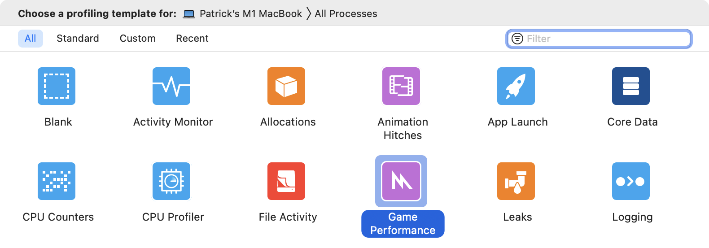
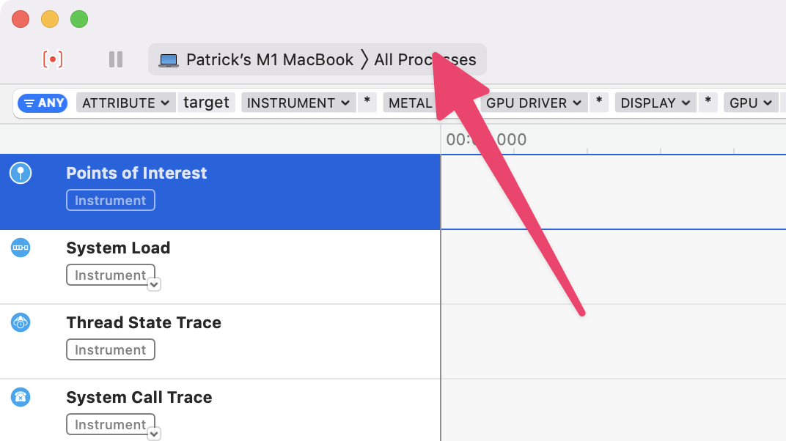
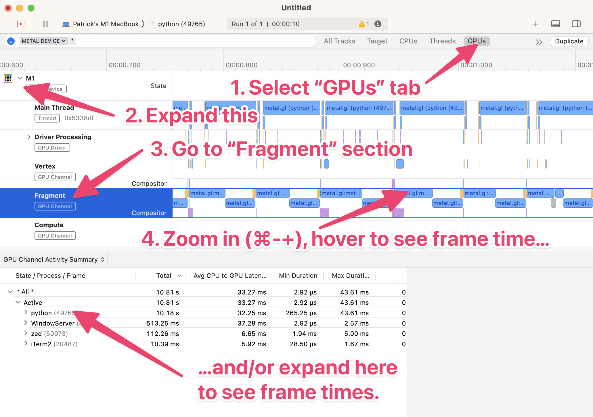

# Shader performance profiling on macOS

I'm writing a GLSL fragment shader, and wanted to better understand its performance. I started this page to collect my notes on how you can do this on macOS with Instruments.

## Basic profiling

1. Run your app (mine's written in Python, using [moderngl][]).
2. Start Instruments.
3. Choose "Game Performance" as the profiling template.

   
4. In the top left, click on "All Processes", and find your application process.

   
5. Click the "record" button in the top left, do stuff in your app, then stop the recording.

To look at the execution time for your fragment shader:

[moderngl]: https://github.com/moderngl/moderngl

Unfortunately I don't know how if/how you can go into more depth. In the Metal Shading Language there are [GPU counters](https://developer.apple.com/documentation/metal/gpu_counters_and_counter_sample_buffers), but I don't think there's any way to use those in GLSL.
