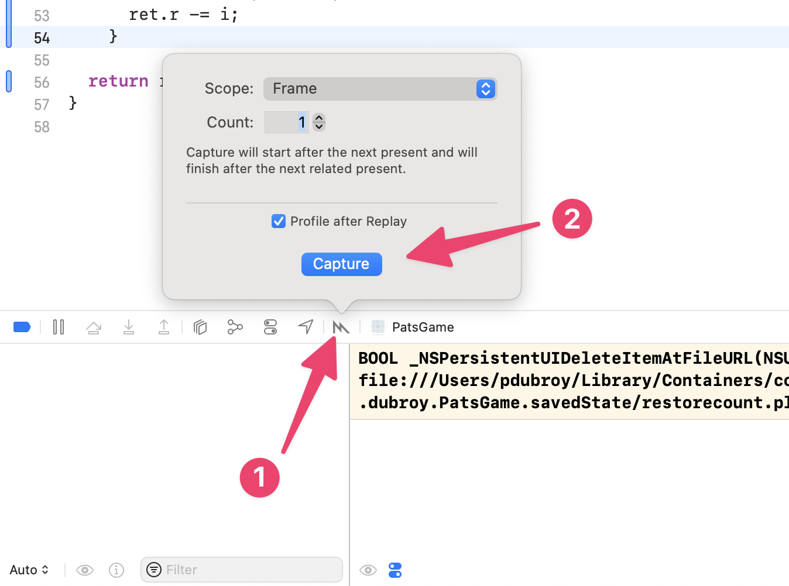
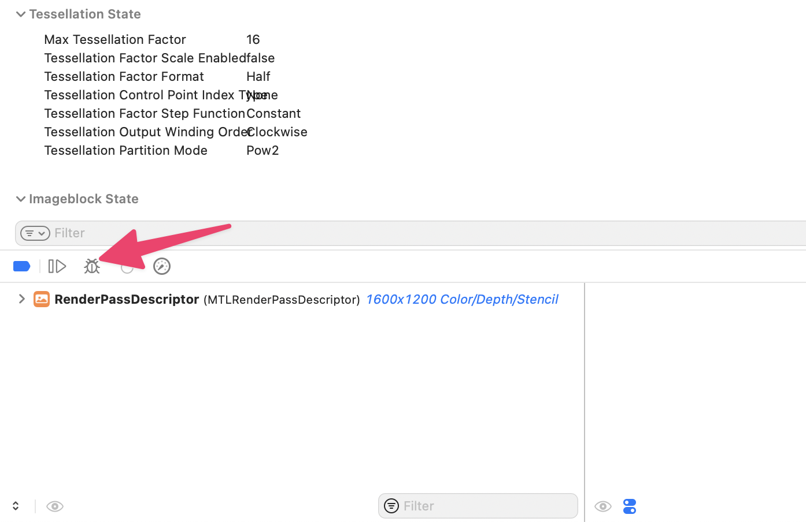
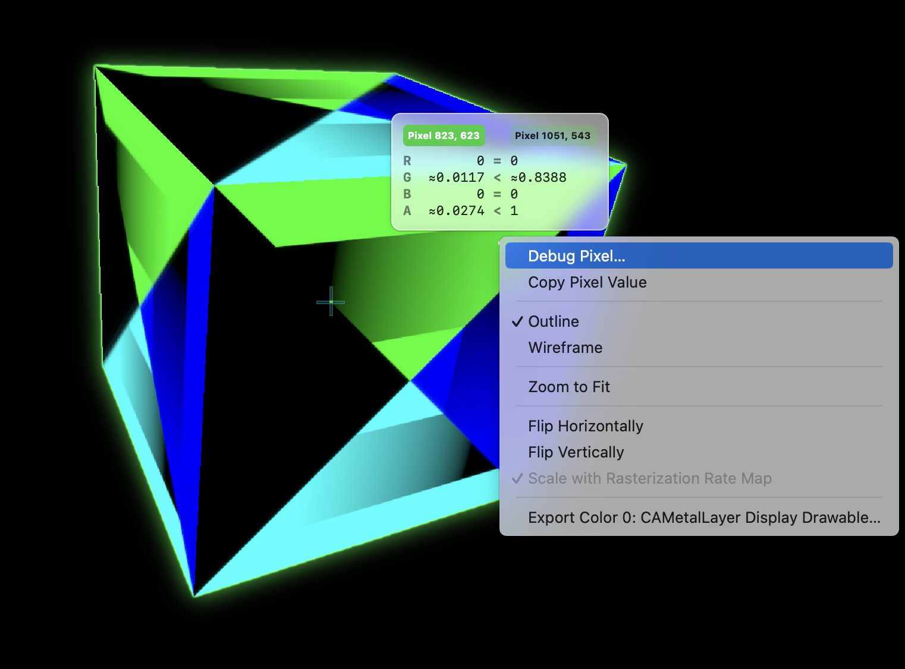
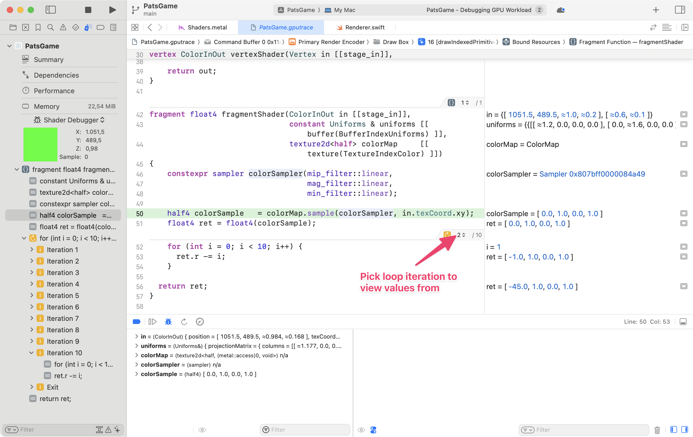

# Debugging shaders

Some context: I'm working on a project involving 2D SDFs, and we're experimenting with moving computation to the GPU (including rendering, but not limited to that). Most of us working on the project primarily work on macOS, so CUDA didn't seem like the best choice.

I started prototyping with an OpenGL fragment shader (written in GLSL). But before going further, I wanted to figure out a good workflow for debugging, either on macOS or Linux. And we're not really tied to OpenGL or GLSL, so I also looked at Metal, Vulkan, and WebGPU.

## What I tried

For macOS/Metal, I only tried XCode. I'm not sure if there are any other credible options for debugging Metal shaders.

For Linux (OpenGL/Vulkan), I started with the [list of debugging tools on the OpenGL wiki](https://www.khronos.org/opengl/wiki/Debugging_Tools), and narrowed it down to [RenderDoc][], [GLSL-Debugger][] aka glslDevil, and [NVIDIA Nsight Graphics][Nsight] as the most promising options.

[RenderDoc]: https://renderdoc.org/
[GLSL-Debugger]: https://glsl-debugger.github.io/
[Nsight]: https://developer.nvidia.com/nsight-graphics

AFAIK, the three tools above all work in basically the same way: they use [the LD_PRELOAD trick](https://www.baeldung.com/linux/ld_preload-trick-what-is) to intercept your program's OpenGL/Vulkan calls and insert instrumentation.

The original code I was trying to debug is written in Python using moderngl, with a fragment shader written in GLSL. For Vulkan, I used the [triangle example](https://github.com/SaschaWillems/Vulkan/tree/master/examples/triangle) from [Sascha Willems' Vulkan examples](https://github.com/SaschaWillems/Vulkan/).

## XCode (Metal)

XCode seemed like the best option by far. I can get full traces of my shader execution, including the ability to inspect all intermediate values (e.g. local variables). For some reason, I still can't get breakpoints to work, but that doesn't seem necessary when I have full traces.

I wasn't able to debug shaders at all with XCode 14 / macOS Ventura, so I bit the bullet and upgraded to Sonoma and XCode 15.

To capture a GPU trace:

1. Run the app in XCode.
2. Click on the Metal button in the debug toolbar. (If you can't find the debug toolbar for some reason, try setting a breakpoint somewhere in the main app code.) Then, click "Capture".

   

To debug —

1. Click the "Debug shader" button in the debug toolbar.

   

2. Hover over the pixel you want to debug. Right click -> Debug pixel.

   

3. You should now see a trace of all the values in your shader program. If there are loops, you can even pick which iteration of the loop to view values from.

   

## RenderDoc

I read lots of good things about RenderDoc, and I found it pretty easy to install and get started with. It turns out it only supports shader debugging for Vulkan, not OpenGL.

It only partially worked with my Python (OpenGL) app. It was able to launch the app, and I could see that the interception was successful, but I wasn't able to capture a trace properly — not sure why.

With a Vulkan program, I was able to step through the SPIR-V disassembly for my shader. In theory, you can compile your shaders to include source-level debug info, and then you'd be able to step through the original GLSL code. But, I didn't invest the time to figure this out.

## GLSL-Debugger

I had to build this from source to get it working on my Ubuntu box (the instructions on the project page were sufficient, if a bit confusing).

The basic setup is similar to RenderDoc. However, I couldn't get it working with my Python app. It

## NVIDIA Nsight

Like RenderDoc, Nsight can only debug shaders in Vulkan apps. I didn't end up trying that, since it didn't seem to offer anything beyond what RenderDoc did.
