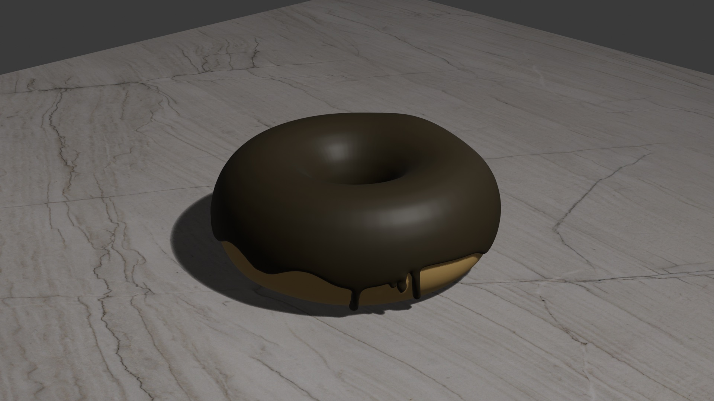

# Blender

A few months back, I ran across the (famous?) [BlenderGuru Donut Tutorial](https://www.youtube.com/playlist?list=PLjEaoINr3zgEPv5y--4MKpciLaoQYZB1Z), a YouTube series for learning [Blender][]. And then my 9-year-old was asking about 3D tools, so we decided to do the tutorial together.

The kid ended up loving it — we made it through the first five videos, with the 9yo doing all the modeling, and me mostly navigating. I had never used Blender before, and don't have much experience with 3D tools at all, but I learned a ton:

[Blender]: https://www.blender.org/

- Add a mesh: <kbd>Shift</kbd>+<kbd>a</kbd> -> _Mesh_ -> _Torus_
- Turn on smooth shading: Right click on object -> _Shade smooth_.
- Add a _subdivision surface_ modifier: <kbd>Ctrl</kbd>+<kbd>1</kbd>
- Switch into _Edit Mode_ to edit the mesh (<kbd>Tab</kbd> to toggle)
- Make the donut a bit more organic looking:
  - Turn on _proportional editing_ (Hotkey: <kbd>o</kbd>)
  - Select a vertex, hit `g` to move it.
  - Use the mouse wheel to adjust the sphere of influence.
- Make the side a bit flatter:
  - Select all the edges around the center: hold <kbd>Alt</kbd>, click an edge.
  - Turn off _proportional editing_ (<kbd>o</kbd>)
  - Hit <kbd>s</kbd> to interactively scale.
- Create the icing:
  - <kbd>Shift</kbd>+d to duplicate the torus.
  - <kbd>Esc</kbd> to place it without modifying the position.
  - Adjust view to look straight down the X or Y axis by clicking on the gizmo
  - Toggle _x-ray mode_ (<kbd>Alt</kbd>+<kbd>z</kbd>) to allow selecting through the mesh.
  - Rectangular select the bottom ⅓ of the mesh.
  - Hit <kbd>x</kbd> and select _Vertices_ to delete the vertices.
- Make the icing thicker:
  - Add a _Solidify_ modifier to the mesh.
  - Change the offset to `1.0000`
- Make the icing droopy:
  - Turn on proportional editing (<kbd>o</kbd>)
  - Turn on snapping (<kbd>Shift</kbd>+<kbd>Tab</kbd>)
  - Under _Snap target for individual elements_, choose _Face project_.
  - Select the vertices around the inside of the donut:
    - Edge select along the inner edge (<kbd>Alt</kbd>+click
    - Hit <kbd>Cmd</kbd>+<kbd>=</kbd> (_Select more_)
  - Select points on the outside edge, <kbd>g</kbd> to move, pull them down a bit.
- Fix the icing edge: in the _solidify_ modifier, under _Edge Data_, set _Crease Inner_ to `1.0000`.
- And more:
  - Sculpt mode: inflate, grab, masking.
  - Textures with roughness, normals

And here's the donut my kid made:

