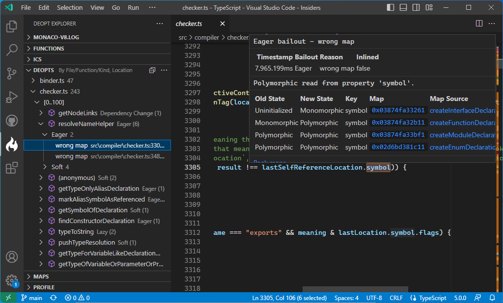

# Finding deoptimizations

If your JavaScript code is running slower than you might expect, it might be due to _deoptimizations_.

When V8 compiles a JavaScript into optimized machine code, it makes certain assumptions about how the code will behave. The compiled code contains checks to detect when the assumptions are violated — and when they are, it throws out the optimized version of the method, and falls back to the interpreter.

So, if you want to improve the performance of your JS code, you want to find out where deoptimization is happening.

## Deopt Explorer

[Deopt Explorer](https://github.com/microsoft/deoptexplorer-vscode) is a VS Code extension for visualizing V8 trace log information. It can show you deoptimization points, along with other useful profiling data.

The instructions in their [How to Use](https://github.com/microsoft/deoptexplorer-vscode?tab=readme-ov-file#how-to-use) section worked well for me.

<figure>
  
  <figcaption>Example of an <i>eager bailout</i> in Deopt Explorer.</figcaption>
</figure>
