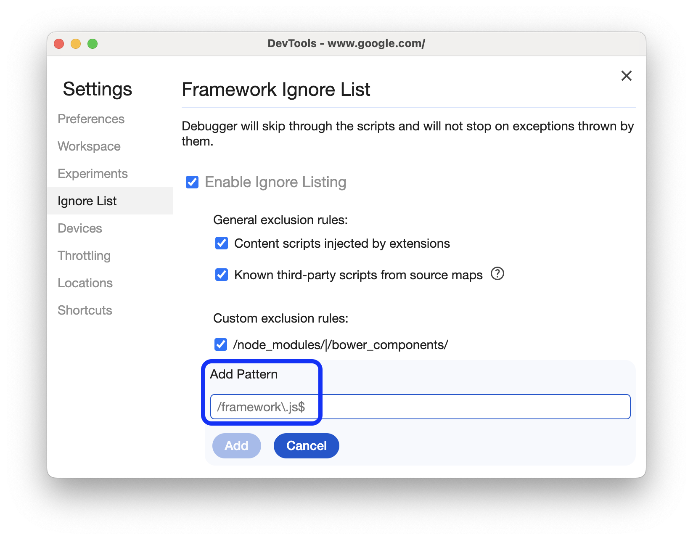

# Source maps in Vite

I'm working on an app written in TypeScript, which is built with Vite. The app depends on a library that's also written in TypeScript, and which ships with source maps.

When I'm debugging the app code, I want to be able to step into a function from the library, and see the original TypeScript source code.

## Problem

This wasn't working for me out of the box. Stepping into one of the library functions would take me to some random, unrelated line in some other file. Sometimes it was a content script from one of my extensions, another time it was some generated WebAssembly that's used in the app.

## Solution

The Chrome dev tools has an _Ignore list_ setting, and [by default, the ignore list includes `node_modules`](https://developer.chrome.com/docs/devtools/settings/ignore-list/#skip-third-party).

The solution is to turn off this setting, or to remove `node_modules` from the ignore list.

<figure>
  
  <figcaption>The Framework Ignore List setting in the Chrome dev tools.</figcaption>
</figure>

## Why does this happen?

At first, I was confused about why I've never encountered a problem like this before. It turns out that it's somewhat specific to Vite.

[Vite doesn't bundle in dev mode](https://vitejs.dev/guide/why.html#slow-server-start). Instead, it relies on the browser-native support for ES modules. So if your app contains the following code:

```js
import * as ohm from "ohm-js";
```

…then in dev mode, Vite will transpile it to something like this:

```js
import * as ohm from "/node_modules/.vite/deps/ohm-js.js?v=7d82ab79";
```

So, you won't encounter this problem with many bundlers, because they're not serving scripts directly from `node_modules`.
