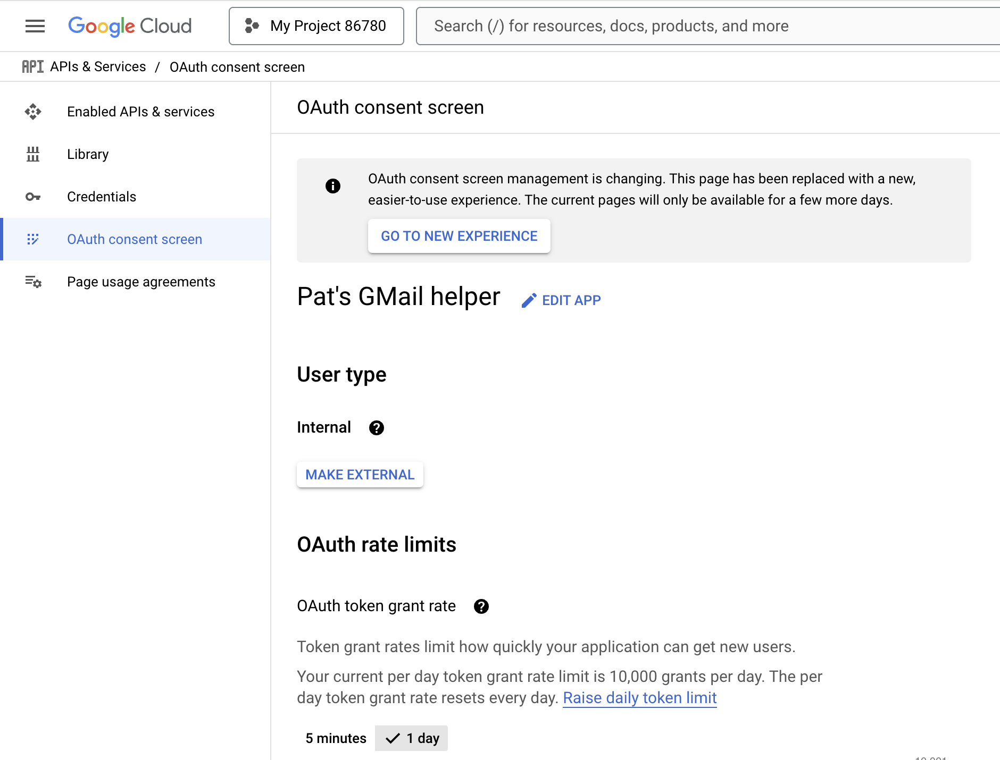

# Scripting GMail with Python

As a freelancer, I periodically need to collect up receipts for all my business expenses. Many of those receipts are in my GMail account. I've always wanted to automate this, but was never willing to dedicate the time required to get a reliable solution working.

Today I decided to take another crack at this with the help of Claude 3.5 Sonnet.

## The script

Here was my prompt:

> please give me a python script that uses the GMail API. Given a query string, it should search for all messages that match the query string, and then download the attachments from those messages to the current working dir. Make it a standalone script that uses the uv tool, with inline dependencies if necessary.

Surprisingly, it had trouble with the inline dependencies. But after I gave it an example, it produced the following script:

```python
# /// script
# requires-python = ">=3.11"
# dependencies = [
#   "google-auth-oauthlib",
#   "google-api-python-client",
# ]
# ///

import os.path
from google.oauth2.credentials import Credentials
from google_auth_oauthlib.flow import InstalledAppFlow
from google.auth.transport.requests import Request
from googleapiclient.discovery import build
import pickle

SCOPES = ['https://www.googleapis.com/auth/gmail.readonly']

def get_credentials():
    creds = None
    if os.path.exists('token.pickle'):
        with open('token.pickle', 'rb') as token:
            creds = pickle.load(token)

    if not creds or not creds.valid:
        if creds and creds.expired and creds.refresh_token:
            creds.refresh(Request())
        else:
            flow = InstalledAppFlow.from_client_secrets_file('credentials.json', SCOPES)
            creds = flow.run_local_server(port=0)
        with open('token.pickle', 'wb') as token:
            pickle.dump(creds, token)
    return creds

def main():
    query = input("Enter Gmail search query: ")

    creds = get_credentials()
    service = build('gmail', 'v1', credentials=creds)

    # Search for messages
    results = service.users().messages().list(userId='me', q=query).execute()
    messages = results.get('messages', [])

    if not messages:
        print("No messages found.")
        return

    # Get and display subject lines
    for message in messages:
        msg = service.users().messages().get(userId='me', id=message['id'], format='metadata',
                                           metadataHeaders=['subject']).execute()
        headers = msg['payload']['headers']
        subject = next((header['value'] for header in headers if header['name'] == 'Subject'), '(no subject)')
        print(f"Subject: {subject}")
if __name__ == '__main__':
    main()
```

## OAuth credentials

For this script to work, you'll need valid OAuth credentials in `credentials.json`. To set that up, I went to [https://console.cloud.google.com/apis/dashboard](https://console.cloud.google.com/apis/dashboard).

The UI is quite confusing, and I got bounced back and forth between the "new experience" and the old one (I guess). But I think this is what I did:

1. Created a new project.
2. Created an OAuth consent screen. The email account I want to access is a Google Workspace account, so I created used the _Internal_ user type, which means that it can only be used within my organization.

  

3. Under _Clients_, clicked _Create client_. For _Application type_, I chose _Desktop app_, and gave it the name "Pat's GMail bot".

  
  

4. Under _Data access_, clicked _Add or remove scopes_, and then under _Manually add scopes_, I entered `https://www.googleapis.com/auth/gmail.modify`.

  
  

5. Finally, downloaded the OAuth client credentials as JSON.

  

## Run the script

- `uv run gmail_search.py`.
- It will open up a window for the OAuth flow. When that was complete, my script hung. So I Ctrl-C'd and then re-ran, and everything worked.
