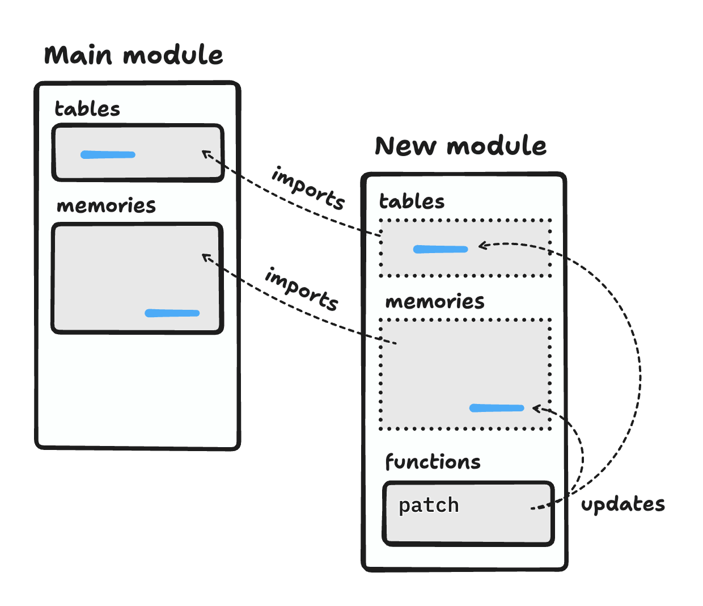

# Run-time code generation in WebAssembly

I first read about this sometime last year, but I decided to write it up since I've been asked about it twice in the past few weeks.

As it stands today, WebAssembly is a great compilation target for languages like C++ and Rust. For people who are interested in dynamic languages, a common question is: does WebAssembly support just-in-time (JIT) code generation?

In his blog post [Just-in-time code generation within WebAssembly](https://wingolog.org/archives/2022/08/18/just-in-time-code-generation-within-webassembly), Andy Wingo explains why it's not so easy:

> In a von Neumman machine, like the ones that you are probably reading this on, code and data share an address space. There's only one kind of pointer, and it can point to anything: the bytes that implement the sin function, the number 42, the characters in "biscuits", or anything at all. WebAssembly is different in that its code is not addressable at run-time. Functions in a WebAssembly module are numbered sequentially from 0, and the WebAssembly call instruction takes the callee as an immediate parameter.

This means that, unlike on a conventional architecture, you can't just patch the call site directly. But, he goes on to explain how late linking of WebAssembly module _is_ in fact possible:

> The key idea here is that to add code, the main program should generate a new WebAssembly module containing that code. Then we run a linking phase to actually bring that new code to life and make it available.

> The generated module will also import the indirect function table from the main module. [...] When the main module makes the generated module, it also embeds a special `patch` function in the generated module. This function will add the new functions to the main module's indirect function table, and perform any relocations onto the main module's memory. All references from the main module to generated functions are installed via the `patch` function.

Here's a diagram to clarify:

(Disclaimer, I have not yet done this myself!)
