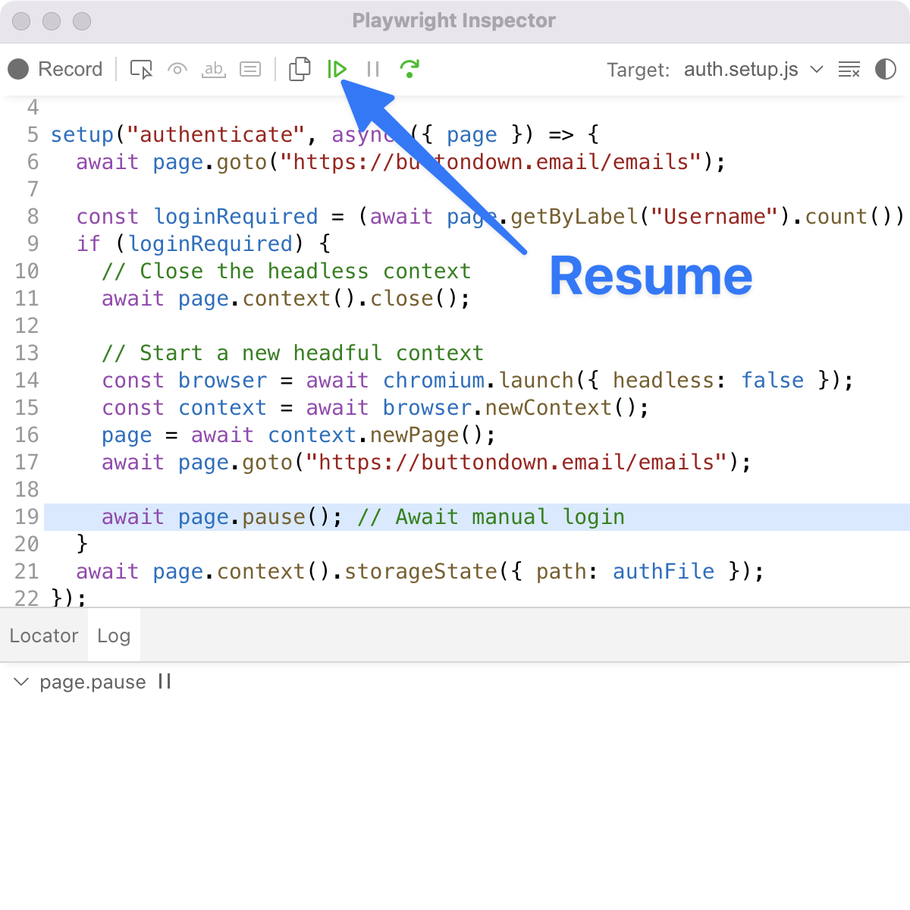

# Authentication in Playwright scripts

Every time I use Playwright, I'm impressed by the quality and usefulness of the tooling they built. So much useful stuff that seems to just work. And it's well-documented, too.

## Problem

I have a Playwright script that requires the user to be logged in. Ideally, I'd like to be able to do the following:

- Detect if the user is logged in.
- If not, open up a browser window to the login page.
- After login, save the cookies to avoid having to log in every time the script is run.

## Solution

Turns out this is quite easy to do in Playwright. There's an [example in the Playwright documentation](https://playwright.dev/docs/auth), which got me most of the way there, but it's a little bit different than what I was looking for.

Here's the script I ended up with:

```ts
const { test, chromium } = require("@playwright/test");
import fs from "node:fs";

const authFile = "playwright/.auth/user.json";

// Use existing storage state if it exists.
test.use({
  storageState: fs.existsSync(authFile) ? authFile : undefined,
});

test("download Buttondown invoices", async ({ page }) => {
  await page.goto("https://buttondown.email/emails");

  const loginRequired = (await page.getByLabel("Username").count()) > 0;
  if (loginRequired) {
    // Close the headless context
    await page.context().close();

    // Start a new headful context
    const browser = await chromium.launch({ headless: false });
    const context = await browser.newContext();
    page = await context.newPage();
    await page.goto("https://buttondown.email/emails");

    await page.pause(); // Await manual login

    // Write the storage state to a file.
    await page.context().storageState({ path: authFile });
  }
  // Proceed in logged in state
  // …
});
```

Note that the call to `page.pause()` will open the [Playwright inspector](https://playwright.dev/docs/debug#playwright-inspector), and you have to click the _Resume_ button in the inspector to continue the script after logging in:



To avoid having to manually continue the script, you could instead use
 [`waitFor`](https://playwright.dev/docs/api/class-locator#locator-wait-for) or something similar.
